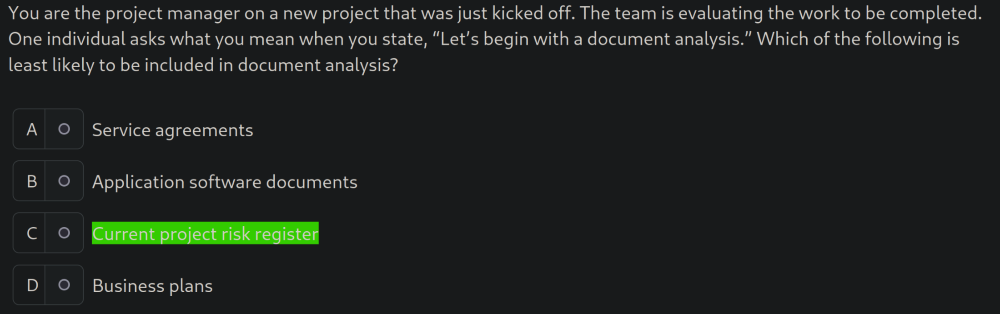

# quiz helper for ucertify Project Management Professional (PMP)
only support choice questions

## demo

## usage
1. install [Tampermonkey](https://www.tampermonkey.net/)

[guide](https://www.tampermonkey.net/faq.php?locale=en#Q100)

2. install the script

click the link below

https://raw.githubusercontent.com/0guanhua0/pmp-quiz-helper/refs/heads/main/helper.user.js

[guide](https://www.tampermonkey.net/faq.php?locale=en#Q102)

## retake
if error, retake can refresh the score

## support
please file issues for support

## roadmap
- [ ] use cv to get info. for text app, use [ocr](https://en.wikipedia.org/wiki/Optical_character_recognition)
- [ ] use ai to understand the context and answer the question

## tips
ai can help development, but it can introduce bugs. these kind of bugs are hard to debug because it seems correct.

ai can provide general suggestions, but final decision should base on the project context.
